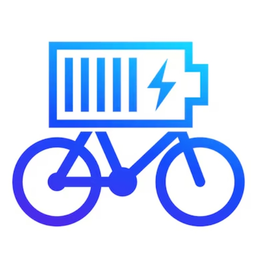

# 🔋 eMTB Consumption Calculator

Questa Progressive Web App (PWA) consente di stimare il consumo di una e-bike (eMTB) in base a un tracciato GPX o a distanza/dislivello inseriti manualmente.  
Funziona **offline** e può essere **installata su PC, Android e iOS**.

---

## 🚀 Funzionalità

- 📂 Caricamento file `.gpx` per analisi distanza e dislivello
- 📊 Calcolo consumo batteria in Wh su base profilo assistenza
- ✍️ Inserimento manuale di distanza/dislivello
- 🛠 Gestione profili personalizzati
- 📉 Grafico altimetria interattivo (con distanza in km)
- 📱 Installabile su smartphone (PWA)
- 🔌 Funziona **completamente offline**
- 📤 Condivisione dei risultati (Web Share API)
- 🧲 Supporto drag & drop file `.gpx`

---

## 📦 File inclusi

- `index.html` – Interfaccia principale
- `manifest.json` – Manifest PWA
- `service-worker.js` – Cache per uso offline
- `chart.umd.min.js` – Libreria Chart.js (salvata localmente)
- `icon.png` – Icona app

---

## 📥 Istruzioni per l'uso

### 🔧 Hosting locale (es. GitHub Pages)

1. Apri l'URL pubblicato (es. `https://tuo-nome.github.io/nome-repo`)
2. Installa l’app dal browser (Chrome, Edge, Safari mobile)

---

## 💡 Personalizzazione

- Puoi modificare i profili di assistenza direttamente dall'interfaccia
- Le impostazioni vengono salvate nel `localStorage` del browser
- Funziona anche con file `.gpx` molto lunghi (ottimizzazione in tempo reale)

---

## ⚠️ Requisiti

- **JavaScript abilitato**
- Chart.js ([chart.umd.min.js](https://cdn.jsdelivr.net/npm/chart.js@4.4.0/dist/chart.umd.min.js)) salvato localmente

---

## 🛠 Sviluppato con

- HTML5, CSS3, JavaScript
- Chart.js
- Service Workers
- Web App Manifest

---

## 📄 Licenza

Progetto open-source disponibile per uso personale, educativo o sportivo.  
Puoi modificarlo liberamente e adattarlo alle tue esigenze.

---

## 🙌 Autore

Creato da [roncoa@gmail.com] 
